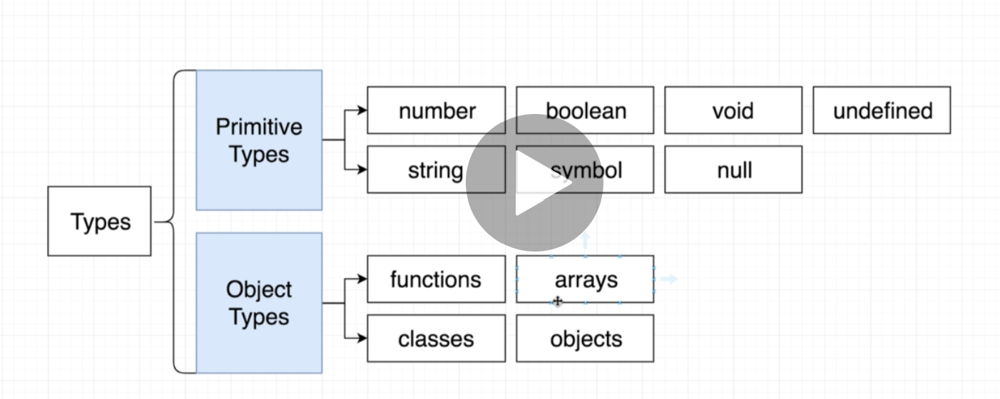
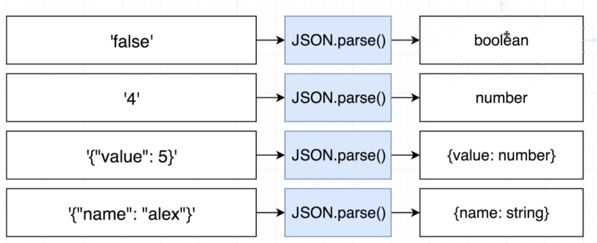

# TS는 개발자로 하여금 좀 더 구조화된 코드를 볼 수 있게 한다.

TS 편해지면 그 다음부턴 JS로 돌아가지 않는다.
개발과정에서 편의성을 증가시켜줌. TYPE의 설정.

- Using Type annotations to analyze our code.
- Only actice during development.

## 3. Environment setup.

2가지 module.

    npm i install -g typescript ts-node

    tsc --help

프리티어 사용 하기.  
prettier.

1. run prettier when saving file
   vs code setting > search > format on save > check.
2. use single quotes.
3. two space for indentations.
4. themes.

## 4. Frist app.

어쨋든 package.json 을 사용한다.

## 5. Executing Typescript code.

tsc meaning is ts compiler.

    tsc index.ts
    node index.js

    ts-node index.ts

    complie하고 실행까지 하는 것.

## 6. One Quick Change.

실행해보고 찍어보기 전까지는 그 object에
내가 바라는 attribute가 있는지 모른다.
jupyter에서는 가능하지만!

## 7. Catching Errors with TS.

    interface Todo {
        id : number
        title : string
        completed : boolean
    }

interface in ts are used to define the structure of an object

## 8. Catching More Errors.

## 9. Course Overview.

- syntax + features

- design patterns with ts.

## 10. Types

Basic Types in TS

Types are just Shortcut.

> Type = Easy way to refer to the different properties + functions that a value has

## 11. More on Types.

You need to remember that.
"Every Value in TS has a type"

인터페이스는 새로운 타입을 정의할 때 쓰는 것.
사용자가 새로운 value를 만들고 그것에 타입을 지정할 때.

1. Primitive Types.
2. Object Types.

## 12. Example of Types.

## 13. Where do we use types?

> Everywhere!

## 14. Type Annotations and Inference.

Type annotations. : 개발자가 말함 (선언).
Type inference. : TS가 짐작함.

## 15. Annotations with Variables.

## 16. Object Literal Annotations.

## 17. Annotations around functions.

## 18. Type Inference.

When to use? Always!

## 19. Any Type.

When to use Type Annotations?

1. When a function returns the any type and we need to clarify the value

2. When we declare a variable on one line then initialize it later.

3. When we want a varialbe to have a type that can't be inferred

json.parse()의 경우. input 값에 따라 어떤 Types이 나올지 모른다.

## 20. Fixing The Any Type.

## 21. Delayed Initialization.

## 22. When Inference Doesn't Work.
