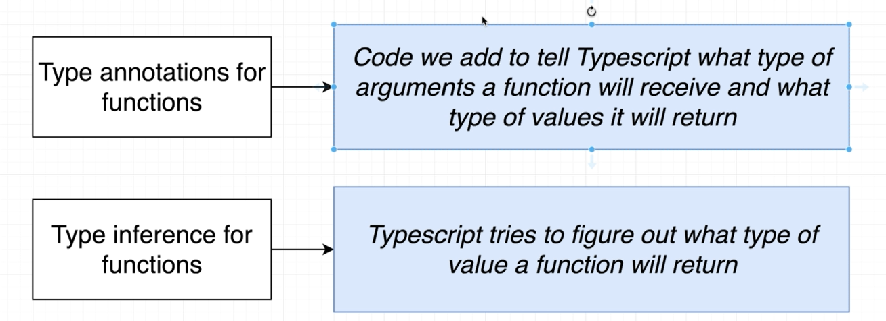
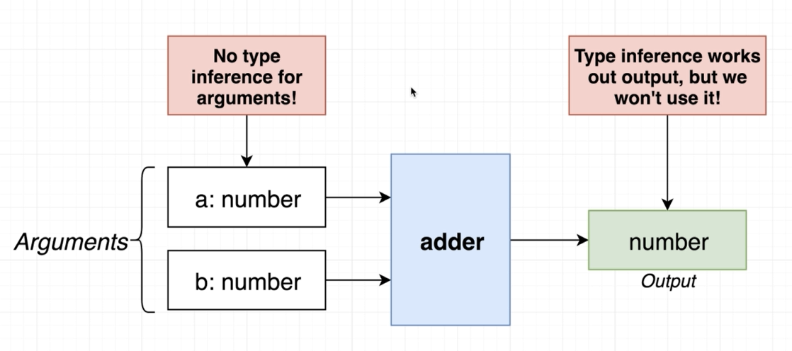
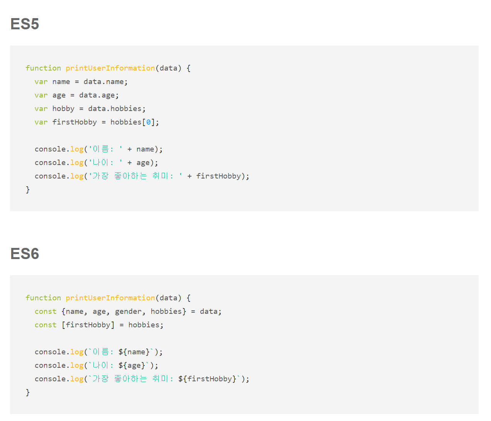
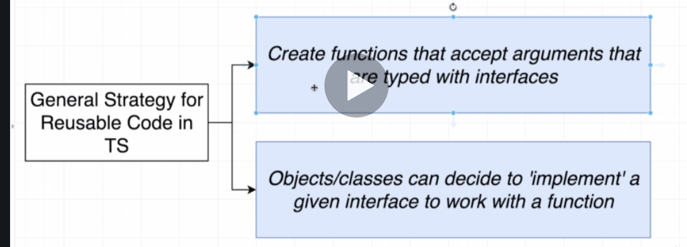
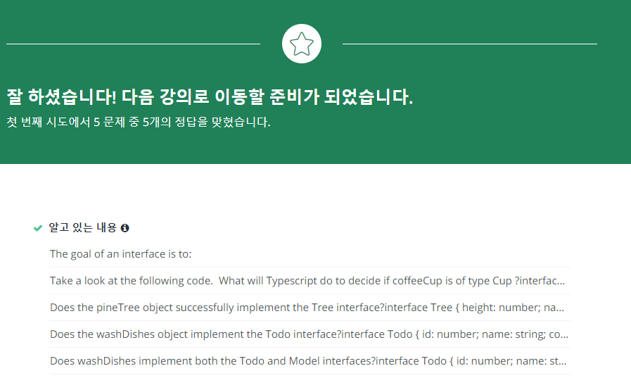

<<<<<<< HEAD
# TS는 개발자로 하여금 좀 더 구조화된 코드를 볼 수 있게 한다.

TS 편해지면 그 다음부턴 JS로 돌아가지 않는다.
개발과정에서 편의성을 증가시켜줌. TYPE의 설정.

- Using Type annotations to analyze our code.
- Only actice during development.

## 3. Environment setup.

2가지 module.

    npm i install -g typescript ts-node

    tsc --help

프리티어 사용 하기.  
prettier.

1. run prettier when saving file
   vs code setting > search > format on save > check.
2. use single quotes.
3. two space for indentations.
4. themes.

## 4. Frist app.

어쨋든 package.json 을 사용한다.

## 5. Executing Typescript code.

tsc meaning is ts compiler.

    tsc index.ts
    node index.js

    ts-node index.ts

    complie하고 실행까지 하는 것.

## 6. One Quick Change.

실행해보고 찍어보기 전까지는 그 object에
내가 바라는 attribute가 있는지 모른다.
jupyter에서는 가능하지만!

## 7. Catching Errors with TS.

    interface Todo {
        id : number
        title : string
        completed : boolean
    }

interface in ts are used to define the structure of an object

## 8. Catching More Errors.

## 9. Course Overview.

- syntax + features

- design patterns with ts.

## 10. Types

Basic Types in TS

Types are just Shortcut.

> Type = Easy way to refer to the different properties + functions that a value has

## 11. More on Types.

You need to remember that.
"Every Value in TS has a type"

인터페이스는 새로운 타입을 정의할 때 쓰는 것.
사용자가 새로운 value를 만들고 그것에 타입을 지정할 때.

1. Primitive Types.
2. Object Types.

## 12. Example of Types.

## 13. Where do we use types?

[variable.ts](features/annotaions/variables.ts)

> Everywhere!

## 14. Type Annotations and Inference.

Type annotations. : 개발자가 말함 (선언).
Type inference. : TS가 짐작함.

## 15. Annotations with Variables.

## 16. Object Literal Annotations.

## 17. Annotations around functions.

## 18. Type Inference.

When to use? Always!

## 19. Any Type.

When to use Type Annotations?

1. When a function returns the any type and we need to clarify the value

2. When we declare a variable on one line then initialize it later.

3. When we want a varialbe to have a type that can't be inferred

json.parse()의 경우. input 값에 따라 어떤 Types이 나올지 모른다.

## 20. Fixing The Any Type.

## 21. Delayed Initialization.

## 22. When Inference Doesn't Work.

# Section 4.

계속해서.
[functions.ts](features/annotaions/functions.ts)

## 23. More annotations around functions.

함수 생성시 types 지정이 awkward 하다.

거의 동일하게 작동한다고 보면 된다.

## 24. Inference Around Functions.

함수 부분 Type 지정이 좀 어렵다.

Type Inference는 output에서 작용하긴 하지만 우리는 이것을 사용하지 않을 것이다!

## 25. Annotations for Anonymous Functions.

JS에서 함수 지정하는 방법은 1. 익명함수를 variable에 지정하는 것과 2. functions 예약어를 사용해 지정하는 것

function keyword로 defined된 함수도 마찬가지로 타입 지정.

마찬가지로 변수에 지정된 익명함수도 마찬가지로 적용된다.
화살표 함수까지 사용한다면 4가지 케이스가 있는 것임.

variable 자체에 함수를 집어넣을 수도 있다. > 콜백함수 개념.

## 26. Void and Never.

## 27. Destructuring with Annotations.

ES6의 디스트럭쳐링 개념이랑 같이 사용하는 것.

## 28. Annotations around Objects

[object.ts](features/annotaions/object.ts)

중요! 디스트럭쳐링 개념 익숙해질 것.

https://poiemaweb.com/es6-destructuring 링크 참고 하기.

## 29. Array in TS.

[array.ts](features/array.ts)

## 30. Why Types Arrays?

## 31. Muplile Types in Array.

## 32. When to use Typed Array?

Any Time we need to represent a collection of records with some arbitrary sort order.

# Sections 6.

## 33. Tuples in Typescript.

Tuple = Array-Like structure where each element presents some property of a record. (파이썬 이랑 다른 듯.)

Array이지만, object의 value들만을 담은 것으로 각 array가 specific한 key를 가지고 있다. 즉 order를 가진다.

## 34. Tuple in actions

[tuple.ts](features/tuple.ts)

## 35. Why Tuples?

CSV 파일을 import 할때나 의미가 있겠지만.
튜플이 가지는 단점이 무엇이겠냐. key가 없어서 처음 본 사람들이 그걸 이해하기 어렵겠다.
=======
# TS는 개발자로 하여금 좀 더 구조화된 코드를 볼 수 있게 한다.

TS 편해지면 그 다음부턴 JS로 돌아가지 않는다.
개발과정에서 편의성을 증가시켜줌. TYPE의 설정.

- Using Type annotations to analyze our code.
- Only actice during development.

## 3. Environment setup.

2가지 module.

    npm i install -g typescript ts-node

    tsc --help

프리티어 사용 하기.  
prettier.

1. run prettier when saving file
   vs code setting > search > format on save > check.
2. use single quotes.
3. two space for indentations.
4. themes.

## 4. Frist app.

어쨋든 package.json 을 사용한다.

## 5. Executing Typescript code.

tsc meaning is ts compiler.

    tsc index.ts
    node index.js

    ts-node index.ts

    complie하고 실행까지 하는 것.

## 6. One Quick Change.

실행해보고 찍어보기 전까지는 그 object에
내가 바라는 attribute가 있는지 모른다.
jupyter에서는 가능하지만!

## 7. Catching Errors with TS.

    interface Todo {
        id : number
        title : string
        completed : boolean
    }

interface in ts are used to define the structure of an object

## 8. Catching More Errors.

## 9. Course Overview.

- syntax + features

- design patterns with ts.

## 10. Types

Basic Types in TS

Types are just Shortcut.

> Type = Easy way to refer to the different properties + functions that a value has

## 11. More on Types.

You need to remember that.
"Every Value in TS has a type"

인터페이스는 새로운 타입을 정의할 때 쓰는 것.
사용자가 새로운 value를 만들고 그것에 타입을 지정할 때.

1. Primitive Types.
2. Object Types.

## 12. Example of Types.

## 13. Where do we use types?

[variable.ts](features/annotaions/variables.ts)

> Everywhere!

## 14. Type Annotations and Inference.

Type annotations. : 개발자가 말함 (선언).
Type inference. : TS가 짐작함.

## 15. Annotations with Variables.

## 16. Object Literal Annotations.

## 17. Annotations around functions.

## 18. Type Inference.

When to use? Always!

## 19. Any Type.

When to use Type Annotations?

1. When a function returns the any type and we need to clarify the value

2. When we declare a variable on one line then initialize it later.

3. When we want a varialbe to have a type that can't be inferred

json.parse()의 경우. input 값에 따라 어떤 Types이 나올지 모른다.

## 20. Fixing The Any Type.

## 21. Delayed Initialization.

## 22. When Inference Doesn't Work.

# Section 4.

계속해서.
[functions.ts](features/annotaions/functions.ts)

## 23. More annotations around functions.

함수 생성시 types 지정이 awkward 하다.

거의 동일하게 작동한다고 보면 된다.

## 24. Inference Around Functions.

함수 부분 Type 지정이 좀 어렵다.

Type Inference는 output에서 작용하긴 하지만 우리는 이것을 사용하지 않을 것이다!

## 25. Annotations for Anonymous Functions.

JS에서 함수 지정하는 방법은 1. 익명함수를 variable에 지정하는 것과 2. functions 예약어를 사용해 지정하는 것

function keyword로 defined된 함수도 마찬가지로 타입 지정.

마찬가지로 변수에 지정된 익명함수도 마찬가지로 적용된다.
화살표 함수까지 사용한다면 4가지 케이스가 있는 것임.

variable 자체에 함수를 집어넣을 수도 있다. > 콜백함수 개념.

## 26. Void and Never.

## 27. Destructuring with Annotations.

ES6의 디스트럭쳐링 개념이랑 같이 사용하는 것.

## 28. Annotations around Objects

[object.ts](features/annotaions/object.ts)

중요! 디스트럭쳐링 개념 익숙해질 것.

https://poiemaweb.com/es6-destructuring 링크 참고 하기.

## 29. Array in TS.

[array.ts](features/array.ts)

## 30. Why Types Arrays?

## 31. Muplile Types in Array.

## 32. When to use Typed Array?

Any Time we need to represent a collection of records with some arbitrary sort order.

# Sections 6.

## 33. Tuples in Typescript.

Tuple = Array-Like structure where each element presents some property of a record. (파이썬 이랑 다른 듯.)

Array이지만, object의 value들만을 담은 것으로 각 array가 specific한 key를 가지고 있다. 즉 order를 가진다.

## 34. Tuple in actions

[tuple.ts](features/tuple.ts)

## 35. Why Tuples?

CSV 파일을 import 할때나 의미가 있겠지만.
튜플이 가지는 단점이 무엇이겠냐. key가 없어서 처음 본 사람들이 그걸 이해하기 어렵겠다.

# Sections 7.

## 36. Interfaces.

[tuple.ts](features/interfaces.ts)

Interfaces + Classes = How we get really strong code reuse in TS.

- Interface = create a new type, describing the property names and value types of an object.

## 37. Lony Type Annotations

나만의 타입을 interface로 만들어놓기.

## 38. Fixing Long annotations with interfaces.

## 39. Syntax around interfaces.

## 40. Functions in interfaces.

Interface를 사용할때, 그 오브젝트 안에
인터페이스를 만족하는 펑션만 있다면 그 Interface에
100% 동일하지 않더라도, 즉 합집합의 형태라면
에러를 반환하지 않는다.

예) 특정한 함수 a가 interface B를 필요로 한다.
interface B에서 선언된 타입은 함수 c() : string 이다.
이때 객체 x가 가지고 있는 keys에 c()만 있다면, 객체 x도
함수 a(x)로 선언될 수 있다는 것이다.

객체 x가 c(),somefunc(),keyA,keyB.
객체 y가 c(), somefunc2(),keyC
이렇게 있어도 함수 a(x), a(y) 둘다 가능하다는 것.

## 41. Code reuse with Interfaces.

하나의 인터페이스로도 굉장히 다른 Object를 정의하여 사용할 수 있다.
이 경우 Drink와 Cars들.

## 42. General Plan with InterFaces.

## 43. QUIZ

>>>>>>> 621e431e21dc0c75c43c6dcbef6cbb057e676375
